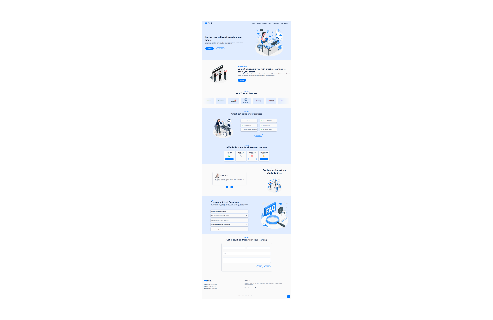

# UpSkill

UpSkill is a Landing Page designed to showcase and promote educational services. The project is built using React.js, TypeScript, and SASS, resulting in a responsive, optimized application that provides an intuitive navigation experience for users.

The development focused on responsive design, following a mobile-first approach. This, combined with the implementation of custom hooks, React Hook Form, and Yup, enhances the layout management of the page.

To ensure code quality and maintain a solid development foundation, tools such as ESLint, Prettier, and development standards like absolute imports, among others, were used.

## Project preview

**UI:**


**Live demo:**
Access the [Live Demo](https://igor-live-demo-upskill.vercel.app/) or copy the URL directly:

```
https://igor-live-demo-upskill.vercel.app/
```

---

## Project resources

**Main technologies:**

- HTML
- SASS
- JavaScript
- TypeScript
- React.js
- React Hook Form
- Yup
- Vite.js

**Development support:**

- Git
- PNPM Package Manager
- Eslint
- Prettier
- Lighthouse
- Vercel

**Extras:**

- Documentation
- Tests
- Standardized code formatting
- Absolute imports
- Live demo on Vercel
- Mobile First
- Responsive UI
- SEO
- Simple animations
- Lighthouse analysis result: 
