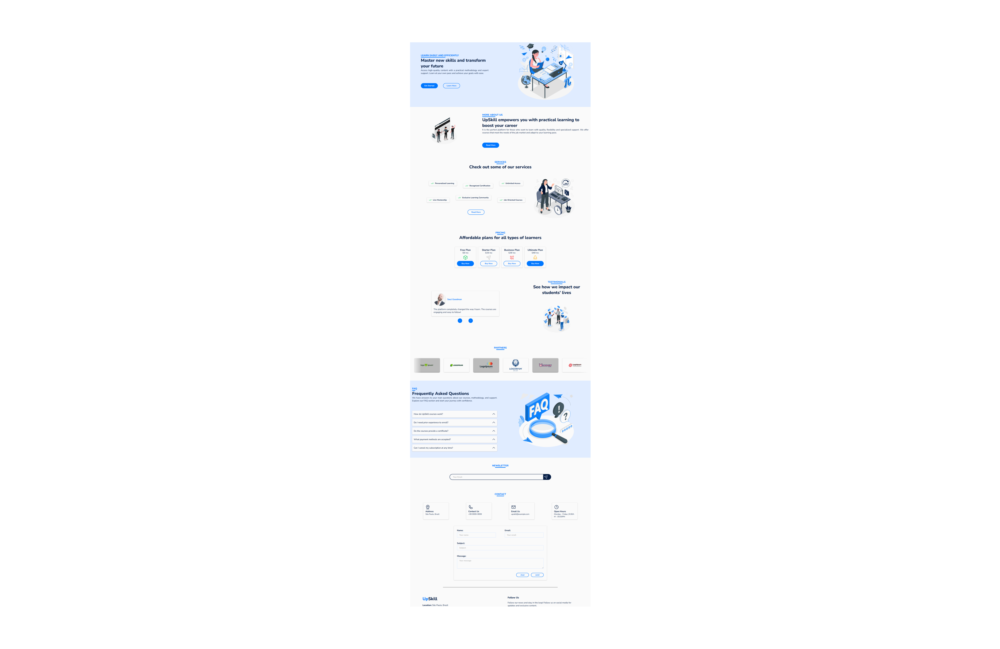

# UpSkill

UpSkill is a Landing Page created to promote and showcase educational services to its users.

The project was built on React.js, TypeScript and SASS, and also implemented other features to aid in its execution, such as custom hooks, state management and form validation.

To ensure the quality of the project, some best practices were adopted during its development, such as a live demo hosted on Vercel, mobile-first and responsive design, and test coverage with Lighthouse. In the code, approaches such as documentation, application of standardized code formatting and use of absolute imports were adopted.

## Project preview

**UI:**


**Live demo:**
Access the [Live Demo](https://igor-live-demo-upskill.vercel.app/) or copy the URL directly:

```
https://igor-live-demo-upskill.vercel.app/
```

---

## Project resources

**Main technologies:**

- HTML
- SASS
- JavaScript
- TypeScript
- React.js
- React Hook Form
- Yup
- Vite.js

**Development support:**

- Git
- PNPM Package Manager
- Eslint
- Prettier
- Lighthouse
- Vercel

**Extras:**

- Documentation
- Tests
- Standardized code formatting
- Absolute imports
- Live demo on Vercel
- Mobile First
- Responsive UI
- BEM Methodology
- SEO
- Animations
- Lighthouse analysis result: 
